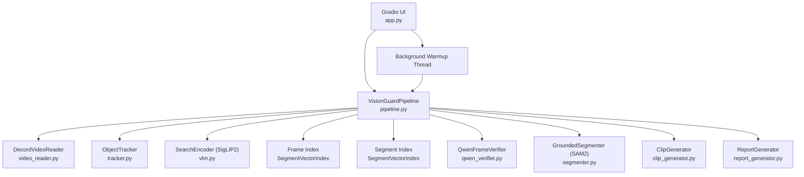
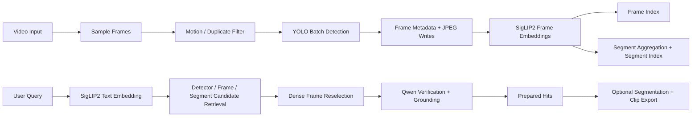

# Vision Guard

Vision Guard is a scan-first CCTV video search application with a Gradio UI. It scans a video once, stores frame and segment embeddings, and then answers natural-language queries by combining detector metadata, SigLIP2 retrieval, dense frame reselection, Qwen visual verification, and optional SAM2 segmentation during export.

This repository is intentionally a single-process inference application. There is no training loop, database server, REST API, or external orchestration service in the tracked runtime code.

## Pipeline Overview


## Documentation

- Full technical manual: [PROJECT_DOCUMENTATION.md](PROJECT_DOCUMENTATION.md)
- Optional external context-compression notes: [optional_integrations/headroom/README.md](optional_integrations/headroom/README.md)
- Colab launcher notebook: [VisionGuard_Colab.ipynb](VisionGuard_Colab.ipynb)

## Audit Status

The repository was re-audited against the current codebase state.

- Tracked source/runtime files: preserved
- Sample assets: preserved
- Optional documentation scaffolds: preserved
- Additional definitively unused files found in the tracked repo: none
- Additional deletions executed in this pass: none

Local environment and runtime infrastructure observed during audit and intentionally preserved:

- `.venv/`
- `.yolo/`
- `output/`
- `yolo11m.pt`

## System Overview



## End-to-End Flow



## Quick Start

### Local

```bash
pip install -r requirements.txt
python app.py
```

Open `http://127.0.0.1:7860`.

### Colab

Use [VisionGuard_Colab.ipynb](VisionGuard_Colab.ipynb). The intended notebook flow is:

1. Clone or refresh the repo in `/content/visionguard-ai`
2. Mount Google Drive
3. Optionally load `HF_TOKEN` from Colab secrets
4. Configure persistent cache directories under `/content/drive/MyDrive/visionguard_cache`
5. Install `requirements.txt`
6. Set:
   - `VISION_GUARD_HOST=0.0.0.0`
   - `GRADIO_SHARE=1`
7. Run `python -u app.py`
8. Open the printed `gradio.live` URL

## Current Feature Set

- Scan-first indexing with live preview during sampling
- Frame-level and segment-level retrieval
- Detector-first exact-object retrieval for supported classes
- Query normalization and limited synonym handling
- Object count aggregation shown after scan completion
- Faster scan path through larger image batches, mixed precision, and overlapped JPEG writes
- Faster query verification through reduced Qwen token budgets, active result caching, and parallel top-hit verification
- Export of selected clips, segmented clips, HTML, CSV, JSON, and ZIP packages

## Tracked Repository Layout

### Runtime code

- `app.py`
- `pipeline.py`
- `cache_utils.py`
- `clip_generator.py`
- `qwen_verifier.py`
- `report_generator.py`
- `segmenter.py`
- `tracker.py`
- `vector_index.py`
- `video_reader.py`
- `vlm.py`

### Configuration and dependency files

- `.gitignore`
- `requirements.txt`

### User and technical documentation

- `README.md`
- `PROJECT_DOCUMENTATION.md`
- `VisionGuard_Colab.ipynb`
- `optional_integrations/headroom/README.md`
- `optional_integrations/headroom/VISION_GUARD_CONTEXT.md`

### Sample assets

- `assets/asset1.mp4`
- `assets/asset2.mp4`
- `assets/asset3.mp4`
- `assets/asset4.mp4`
- `assets/asset5.mp4`
- `assets/asset6.mp4`

## Runtime Stack

- UI: Gradio
- Video access: Decord with OpenCV fallback
- Detection-first wrapper: Ultralytics YOLO; tracking support exists in `tracker.py` via BoT-SORT config, but the main scan/index path currently uses batched detection rather than persisted track IDs
- Image/text retrieval model: `google/siglip2-so400m-patch14-384`
- Visual verification and grounding: `Qwen/Qwen2.5-VL-7B-Instruct-AWQ`
- Segmentation: `facebook/sam2.1-hiera-small`
- Vector search backend: turbovec `IdMapIndex` with NumPy fallback
- Reporting: JSON, CSV, HTML, ZIP

## Query Semantics

The current pipeline is object-focused.

- Supported detector-style queries such as `person`, `white car`, `yellow car`, `truck`, `umbrella`, and `backpack` can use detector metadata directly.
- Event-style queries such as `fight`, `accident`, `collision`, `crowd`, `fall`, and `loitering` are intentionally rejected before retrieval.
- Unsupported simple exact-object labels are also rejected conservatively rather than loosely substituted.
- Trusted detector/object-fallback hits may still be returned when verifier confirmation is absent, but only for supported object-style queries.

## Outputs

Each scan creates a timestamped run directory under `output/` containing:

- `frames/`
- `clips/`
- `reports/`
- `segments/`

The scan report metadata now includes:

- `video`
- `fps`
- `frames`
- `duration`
- `sample_sec`
- `win_sec`
- `segments`
- `object_counts`
- `total_detections`
- `unique_objects`

`object_counts` and `total_detections` are derived from per-frame object-label presence in indexed frames. In other words, they count how many indexed frames contained each label, not the total number of raw detector boxes across the whole video.

## Read Next

For the full architecture, file-by-file audit, data contracts, Mermaid diagrams, and operational caveats, continue to [PROJECT_DOCUMENTATION.md](PROJECT_DOCUMENTATION.md).
